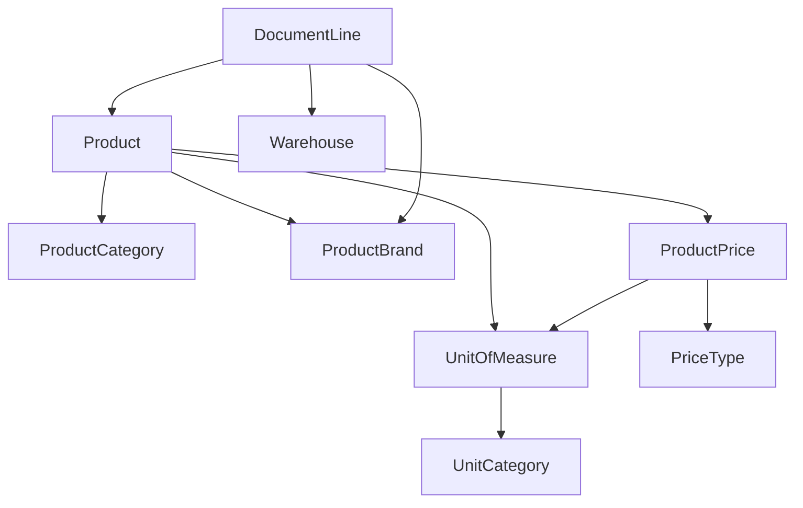

# 📦 Manual de Creación de Productos con Precios - ChalanPro

## 🎯 Introducción

Este manual detalla el proceso completo para crear productos con sus precios, unidades de medida por defecto, warehouses y brands en el sistema ChalanPro, permitiendo realizar transacciones exitosas.

---

## 🏗️ Arquitectura del Sistema de Productos

### Modelos Principales

El sistema ChalanPro maneja los productos mediante los siguientes modelos interconectados:



---

## 📋 Paso 1: Configuración de Datos Base

### 1.1 Categorías de Unidades de Medida (UnitCategory)

**Ubicación:** `appinventory/models.py` - Línea 7

Las categorías organizan las unidades por tipo:

| Categoría | Descripción | Ejemplos |
|-----------|-------------|----------|
| **Length** | Unidades de longitud | FT, IN, YD, M, 100FT, 250FT |
| **Weight** | Unidades de peso | LB, OZ, KG |
| **Volume** | Unidades de volumen | GAL, QT, PT, L |
| **Area** | Unidades de área | SQFT, SQIN |
| **Count** | Unidades de conteo | EA, BOX, PK, SET, KIT |
| **Electrical** | Unidades eléctricas | A, V, W |

```python
# Crear nueva categoría
unit_category = UnitCategory.objects.create(
    name="Length",
    description="Unidades de longitud para cables y tuberías",
    is_active=True
)
```

### 1.2 Unidades de Medida (UnitOfMeasure)

**Ubicación:** `appinventory/models.py` - Línea 16

#### Sistema de Conversiones

- **`reference_unit = True`**: Unidad base de la categoría (factor = 1.0)
- **`conversion_sign = '*'`**: Unidad mayor que referencia (multiplicar)
- **`conversion_sign = '/'`**: Unidad menor que referencia (dividir)

```python
# Ejemplo: Crear unidades de longitud
# Unidad de referencia (FT)
unit_ft = UnitOfMeasure.objects.create(
    name="Foot",
    code="FT",
    category=length_category,
    reference_unit=True,
    conversion_sign="ref",
    conversion_factor=1.0000,
    is_active=True
)

# Rollo de 250 pies
unit_250ft = UnitOfMeasure.objects.create(
    name="250 Foot Roll",
    code="250FT", 
    category=length_category,
    reference_unit=False,
    conversion_sign="*",
    conversion_factor=250.0000,
    is_active=True
)

# Pulgadas (menor que referencia)
unit_inch = UnitOfMeasure.objects.create(
    name="Inch",
    code="IN",
    category=length_category,
    reference_unit=False,
    conversion_sign="/",
    conversion_factor=12.0000,  # 1 pie = 12 pulgadas
    is_active=True
)
```

### 1.3 Warehouses (Almacenes)

**Ubicación:** `appinventory/models.py` - Línea 47

```python
# Crear warehouse predeterminado
warehouse = Warehouse.objects.create(
    name="Almacén Principal",
    location="Bodega Central - Piso 1",
    is_active=True,
    is_default=True  # ¡IMPORTANTE! Solo uno puede ser default
)
```

⚠️ **IMPORTANTE**: Solo un warehouse puede tener `is_default=True` en todo el sistema.

### 1.4 Categorías de Productos (ProductCategory)

```python
category = ProductCategory.objects.create(
    name="Cables y Alambres",
    description="Cables THHN, XHHW, Romex y accesorios",
    is_active=True
)
```

### 1.5 Marcas de Productos (ProductBrand)

```python
brand = ProductBrand.objects.create(
    name="SIEMENS",
    is_active=True
)
```

### 1.6 Tipos de Precio (PriceType)

```python
# Crear tipos de precio estándar
price_types = [
    {"name": "LIST", "description": "Precio de lista estándar"},
    {"name": "COST", "description": "Costo de compra"},
    {"name": "SALE", "description": "Precio de venta"},
    {"name": "WHOLESALE", "description": "Precio al mayoreo"},
    {"name": "CONTRACTOR", "description": "Precio para contratistas"}
]

for pt_data in price_types:
    PriceType.objects.create(**pt_data, is_active=True)
```

---

## 📦 Paso 2: Crear Producto Base

### 2.1 Estructura del Modelo Product

**Ubicación:** `appinventory/models.py` - Línea 74

```python
class Product(models.Model):
    name = models.CharField(max_length=255)              # Nombre del producto
    sku = models.CharField(max_length=100, unique=True)  # Código único
    category = models.ForeignKey(ProductCategory, ...)   # Categoría
    brand = models.ForeignKey(ProductBrand, ...)         # Marca (opcional)
    reorder_level = models.DecimalField(...)             # Nivel de reorden
    unit_default = models.ForeignKey(UnitOfMeasure, ...) # Unidad por defecto
    created_at = models.DateTimeField(auto_now_add=True)
    is_active = models.BooleanField(default=True)
```

### 2.2 Crear Producto Paso a Paso

```python
# 1. Obtener referencias necesarias
category = ProductCategory.objects.get(name="Cables y Alambres")
brand = ProductBrand.objects.get(name="SIEMENS") 
unit_default = UnitOfMeasure.objects.get(code="FT")  # Por defecto en pies

# 2. Crear el producto
product = Product.objects.create(
    name="Cable THHN 12 AWG Negro",
    sku="THHN-12-BLK",
    category=category,
    brand=brand,
    unit_default=unit_default,
    reorder_level=100.00,  # Reabastecer cuando baje de 100 pies
    is_active=True
)
```

### 2.3 Validaciones Importantes

✅ **SKU único**: El sistema valida que no exista otro producto con el mismo SKU.
✅ **Unidad por defecto**: Debe existir en la tabla UnitOfMeasure.
✅ **Categoría requerida**: Un producto debe tener categoría.

---

## 💰 Paso 3: Configurar Precios del Producto

### 3.1 Estructura del Modelo ProductPrice

**Ubicación:** `appinventory/models.py` - Línea 96

```python
class ProductPrice(models.Model):
    product = models.ForeignKey(Product, related_name="prices", ...)
    price_type = models.ForeignKey(PriceType, ...)
    unit = models.ForeignKey(UnitOfMeasure, ...)        # Unidad específica
    price = models.DecimalField(max_digits=10, decimal_places=2)
    is_default = models.BooleanField(default=False)     # Precio por defecto
    is_sale = models.BooleanField(default=False)        # Para ventas
    is_purchase = models.BooleanField(default=False)    # Para compras
    valid_from = models.DateField(null=True, blank=True)
    valid_until = models.DateField(null=True, blank=True)
    is_active = models.BooleanField(default=True)
```

### 3.2 Crear Sistema de Precios Completo

#### Precio Base (LIST)
```python
# Precio base por pie - ESTE ES EL PRECIO DEFAULT
price_list_ft = ProductPrice.objects.create(
    product=product,
    price_type=PriceType.objects.get(name="LIST"),
    unit=UnitOfMeasure.objects.get(code="FT"),
    price=1.25,  # $1.25 por pie
    is_default=True,    # ¡PRECIO POR DEFECTO!
    is_sale=True,       # Se usa en ventas
    is_purchase=False,
    is_active=True
)
```

#### Precio por Rollo
```python
# Precio por rollo de 250 pies
price_list_250ft = ProductPrice.objects.create(
    product=product,
    price_type=PriceType.objects.get(name="LIST"),
    unit=UnitOfMeasure.objects.get(code="250FT"),
    price=275.00,  # $275.00 por rollo de 250 pies
    is_default=False,
    is_sale=True,
    is_purchase=False,
    is_active=True
)
```

#### Precio de Costo
```python
# Costo de compra (65% del precio de lista)
price_cost_ft = ProductPrice.objects.create(
    product=product,
    price_type=PriceType.objects.get(name="COST"),
    unit=UnitOfMeasure.objects.get(code="FT"),
    price=0.81,  # 65% de $1.25
    is_default=False,
    is_sale=False,
    is_purchase=True,   # Se usa en compras
    is_active=True
)
```

#### Precios Especiales
```python
# Precio mayorista (80% del precio de lista)
price_wholesale = ProductPrice.objects.create(
    product=product,
    price_type=PriceType.objects.get(name="WHOLESALE"),
    unit=UnitOfMeasure.objects.get(code="FT"),
    price=1.00,  # 80% de $1.25
    is_default=False,
    is_sale=True,
    is_purchase=False,
    is_active=True
)

# Precio para contratistas (85% del precio de lista)
price_contractor = ProductPrice.objects.create(
    product=product,
    price_type=PriceType.objects.get(name="CONTRACTOR"),
    unit=UnitOfMeasure.objects.get(code="FT"),
    price=1.06,  # 85% de $1.25
    is_default=False,
    is_sale=True,
    is_purchase=False,
    is_active=True
)
```

### 3.3 Reglas de Validación para Precios

⚠️ **IMPORTANTE**: 
- Un producto puede tener **solo UN precio default por unidad**
- Cada precio debe ser **is_sale=True** o **is_purchase=True** (o ambos)
- La combinación `(product, price_type, unit, valid_from, valid_until)` debe ser única

---

## 🏪 Paso 4: Configuración de Warehouse por Defecto

### 4.1 Verificar Warehouse Predeterminado

```python
# Obtener warehouse por defecto
default_warehouse = Warehouse.objects.filter(
    is_default=True, 
    is_active=True
).first()

if not default_warehouse:
    # Crear si no existe
    default_warehouse = Warehouse.objects.create(
        name="Almacén Principal",
        location="Bodega Central",
        is_active=True,
        is_default=True
    )
```

### 4.2 API para Obtener Warehouse Predeterminado

**Ubicación:** `appinventory/views.py` - Línea 248

```python
# Endpoint: GET /api/inventory/default-warehouse/
class DefaultWarehouseAPIView(APIView):
    def get(self, request):
        default_warehouse = Warehouse.objects.filter(
            is_default=True, 
            is_active=True
        ).first()
        
        if default_warehouse:
            return Response({
                'id': default_warehouse.id,
                'name': default_warehouse.name,
            })
```

---

## 🛍️ Paso 5: Crear Transacción con el Producto

### 5.1 Estructura de DocumentLine

**Ubicación:** `apptransactions/models.py` - Línea 236

Cuando un usuario crea una transacción, cada línea contiene:

```python
class DocumentLine(models.Model):
    document = models.ForeignKey(Document, ...)
    product = models.ForeignKey(Product, ...)           # Producto seleccionado
    quantity = models.DecimalField(...)                 # Cantidad
    unit = models.ForeignKey(UnitOfMeasure, ...)        # Unidad específica
    unit_price = models.DecimalField(...)               # Precio por unidad
    warehouse = models.ForeignKey(Warehouse, ...)       # Almacén (si requerido)
    price_type = models.ForeignKey(PriceType, ...)      # Tipo de precio usado
    brand = models.ForeignKey(ProductBrand, ...)        # Marca específica
```

### 5.2 Flujo de Creación de Transacción

#### Obtener Precio Predeterminado del Producto

**Endpoint:** `GET /api/inventory/products/{id}/default-price/`
**Ubicación:** `appinventory/views.py` - Línea 204

```python
# API que retorna el precio default del producto
def get_default_price(product_id):
    product = Product.objects.get(id=product_id)
    
    # Buscar precio predeterminado
    default_price = product.prices.filter(
        is_default=True, 
        is_active=True
    ).first()
    
    return {
        'unit': default_price.unit.id,
        'unit_name': default_price.unit.name,
        'unit_price': float(default_price.price),
        'price_type': default_price.price_type.id,
        'brand': product.brand.id if product.brand else None,
    }
```

#### Ejemplo de DocumentLine Completa

```python
# Crear línea de documento para venta
document_line = DocumentLine.objects.create(
    document=sales_document,
    product=product,                    # Cable THHN 12 AWG Negro
    quantity=50.00,                     # 50 pies
    unit=UnitOfMeasure.objects.get(code="FT"),  # Por pie
    unit_price=1.25,                    # $1.25 por pie
    discount_percentage=0.00,
    warehouse=default_warehouse,        # Almacén predeterminado
    price_type=PriceType.objects.get(name="LIST"),  # Precio de lista
    brand=product.brand                 # Marca del producto
)
```

### 5.3 Conversiones Automáticas de Unidades

**Ubicación:** `appinventory/helpers.py` - Línea 3

El sistema convierte automáticamente las cantidades:

```python
def convert_to_reference_unit(product, unit, quantity):
    """Convierte cantidad a unidad de referencia del producto"""
    
    if unit == product.unit_default:
        return quantity  # Sin conversión necesaria
    
    factor = unit.conversion_factor
    sign = unit.conversion_sign
    
    if sign == '*':
        return quantity * factor  # Ej: 1 rollo 250FT = 250 FT
    elif sign == '/':
        return quantity / factor  # Ej: 12 IN = 1 FT
    else:
        return quantity
```

**Ejemplo práctico:**
- Usuario vende 1 rollo de 250FT → Sistema convierte a 250 FT para inventario
- Usuario vende 24 pulgadas → Sistema convierte a 2 FT para inventario

---

## 🎯 Casos de Uso Prácticos

### Caso 1: Cable THHN por Rollo y por Pie

```python
# Producto: Cable THHN 12 AWG
product = Product.objects.create(
    name="Cable THHN 12 AWG Negro",
    sku="THHN-12-BLK",
    unit_default=UnitOfMeasure.objects.get(code="FT")  # Base en pies
)

# Precios múltiples
prices = [
    # Por pie (precio default)
    {"unit": "FT", "price": 1.25, "is_default": True},
    # Por rollo de 250 pies  
    {"unit": "250FT", "price": 275.00, "is_default": False},
    # Por rollo de 1000 pies
    {"unit": "1000FT", "price": 1050.00, "is_default": False}
]

for price_data in prices:
    ProductPrice.objects.create(
        product=product,
        price_type=PriceType.objects.get(name="LIST"),
        unit=UnitOfMeasure.objects.get(code=price_data["unit"]),
        price=price_data["price"],
        is_default=price_data["is_default"],
        is_sale=True,
        is_purchase=False
    )
```

### Caso 2: Producto con Múltiples Marcas

```python
# Producto genérico: Interruptor sencillo
product = Product.objects.create(
    name="Interruptor Sencillo 15A",
    sku="SW-SINGLE-15A",
    category=ProductCategory.objects.get(name="Electrical Equipment"),
    brand=None,  # Sin marca específica en el producto base
    unit_default=UnitOfMeasure.objects.get(code="EA")
)

# Precios por marca
brands_prices = [
    {"brand": "LEVITON", "price": 8.50},
    {"brand": "LEGRAND", "price": 9.25},
    {"brand": "SIEMENS", "price": 12.00}
]

for bp in brands_prices:
    brand = ProductBrand.objects.get(name=bp["brand"])
    ProductPrice.objects.create(
        product=product,
        price_type=PriceType.objects.get(name="LIST"),
        unit=product.unit_default,
        price=bp["price"],
        is_default=(bp["brand"] == "LEVITON"),  # LEVITON como default
        is_sale=True,
        is_purchase=False
    )
```

### Caso 3: Producto Líquido con Diferentes Presentaciones

```python
# Producto: Sellador PVC
product = Product.objects.create(
    name="Sellador PVC Transparente",
    sku="SEAL-PVC-CLEAR",
    unit_default=UnitOfMeasure.objects.get(code="GAL")  # Base en galones
)

# Precios por presentación
presentations = [
    {"unit": "PT", "price": 15.50},      # Por pinta
    {"unit": "QT", "price": 28.00},      # Por cuarto
    {"unit": "GAL", "price": 95.00, "is_default": True}  # Por galón
]

for pres in presentations:
    ProductPrice.objects.create(
        product=product,
        price_type=PriceType.objects.get(name="LIST"),
        unit=UnitOfMeasure.objects.get(code=pres["unit"]),
        price=pres["price"],
        is_default=pres.get("is_default", False),
        is_sale=True,
        is_purchase=False
    )
```

---

## ⚙️ Configuración del Frontend

### Flujo de Creación en Vue.js

1. **Seleccionar Producto**: Autocomplete con productos activos
2. **Obtener Datos Automáticos**: API llama a `/default-price/` y `/default-warehouse/`
3. **Permitir Modificaciones**: Usuario puede cambiar unidad, precio, warehouse
4. **Validar y Guardar**: Sistema valida y crea DocumentLine

### APIs Principales Utilizadas

| Endpoint | Método | Propósito |
|----------|--------|-----------|
| `/api/inventory/products/{id}/default-price/` | GET | Obtener precio predeterminado |
| `/api/inventory/default-warehouse/` | GET | Obtener warehouse predeterminado |
| `/api/transactions/documents/` | POST | Crear transacción |
| `/api/transactions/document-lines/` | POST | Crear línea de transacción |

---

## 🔍 Consultas SQL Útiles

### Verificar Configuración de Producto

```sql
-- Ver producto con sus precios y configuración
SELECT 
    p.sku,
    p.name,
    pc.name as categoria,
    pb.name as marca,
    u.code as unidad_default,
    pp.price,
    pt.name as tipo_precio,
    pp.is_default,
    pu.code as unidad_precio
FROM appinventory_product p
LEFT JOIN appinventory_productcategory pc ON p.category_id = pc.id
LEFT JOIN appinventory_productbrand pb ON p.brand_id = pb.id  
LEFT JOIN appinventory_unitofmeasure u ON p.unit_default_id = u.id
LEFT JOIN appinventory_productprice pp ON p.id = pp.product_id
LEFT JOIN appinventory_pricetype pt ON pp.price_type_id = pt.id
LEFT JOIN appinventory_unitofmeasure pu ON pp.unit_id = pu.id
WHERE p.sku = 'THHN-12-BLK'
ORDER BY pp.is_default DESC, pt.name;
```

### Verificar Warehouse Predeterminado

```sql
-- Verificar que solo hay un warehouse default
SELECT id, name, is_default, is_active 
FROM appinventory_warehouse 
WHERE is_default = TRUE AND is_active = TRUE;
```

### Productos Sin Precios

```sql
-- Encontrar productos sin precios configurados
SELECT p.sku, p.name
FROM appinventory_product p
LEFT JOIN appinventory_productprice pp ON p.id = pp.product_id
WHERE pp.id IS NULL AND p.is_active = TRUE;
```

---

## ✅ Checklist de Validación

### Antes de Crear Producto

- [ ] Verificar que existe la **UnitCategory** necesaria
- [ ] Crear **UnitOfMeasure** con conversiones correctas
- [ ] Configurar **Warehouse** predeterminado (`is_default=True`)
- [ ] Crear **ProductCategory** apropiada
- [ ] Crear **ProductBrand** si es necesario
- [ ] Configurar **PriceTypes** del sistema

### Al Crear Producto

- [ ] **SKU único** en todo el sistema
- [ ] **Categoría asignada** correctamente  
- [ ] **Unidad por defecto** válida
- [ ] **Nivel de reorden** apropiado
- [ ] **is_active = True**

### Al Configurar Precios

- [ ] **Un precio default por unidad** (`is_default=True`)
- [ ] **is_sale** o **is_purchase** debe ser True
- [ ] **Precios en múltiples unidades** si es necesario
- [ ] **Fechas de vigencia** si aplican
- [ ] **Tipos de precio** correctos (LIST, COST, WHOLESALE, etc.)

### Para Transacciones

- [ ] **Warehouse predeterminado** configurado
- [ ] **API de precio default** funcionando
- [ ] **Conversiones de unidades** probadas
- [ ] **Validaciones de DocumentLine** activas

---

## 🚨 Problemas Comunes y Soluciones

### Problema 1: "No default warehouse found"

**Solución:**
```python
# Configurar warehouse predeterminado
warehouse = Warehouse.objects.filter(is_active=True).first()
if warehouse:
    Warehouse.objects.update(is_default=False)  # Desactivar todos
    warehouse.is_default = True
    warehouse.save()
```

### Problema 2: "Multiple default prices for same unit"

**Solución:**
```python
# Limpiar precios duplicados por defecto
product = Product.objects.get(sku="THHN-12-BLK")
unit = UnitOfMeasure.objects.get(code="FT")

# Desactivar todos los defaults para esta unidad
ProductPrice.objects.filter(
    product=product, 
    unit=unit, 
    is_default=True
).update(is_default=False)

# Activar solo uno como default
default_price = ProductPrice.objects.filter(
    product=product, 
    unit=unit,
    price_type__name="LIST"
).first()
default_price.is_default = True
default_price.save()
```

### Problema 3: "Unit conversion error"

**Solución:** Verificar factores de conversión:
```sql
-- Ver unidades con conversiones incorrectas
SELECT code, name, conversion_sign, conversion_factor
FROM appinventory_unitofmeasure 
WHERE conversion_factor <= 0 OR conversion_factor IS NULL;
```

---

## 📊 Métricas de Rendimiento

### Consultas Optimizadas

El sistema utiliza `select_related` y `prefetch_related` para optimizar consultas:

```python
# En ProductViewSet
queryset = Product.objects.select_related(
    'category', 'brand', 'unit_default'
).prefetch_related('prices__price_type', 'prices__unit')
```

### Índices Recomendados

```sql
-- Índices para mejorar rendimiento
CREATE INDEX idx_product_sku ON appinventory_product(sku);
CREATE INDEX idx_product_active ON appinventory_product(is_active);
CREATE INDEX idx_productprice_default ON appinventory_productprice(is_default);
CREATE INDEX idx_warehouse_default ON appinventory_warehouse(is_default);
```

---

## 🔄 Mantenimiento y Actualizaciones

### Actualización Masiva de Precios

```python
# Aumentar todos los precios LIST en 5%
from decimal import Decimal

list_prices = ProductPrice.objects.filter(
    price_type__name="LIST",
    is_active=True
)

for price in list_prices:
    price.price = price.price * Decimal('1.05')
    price.save()
```

### Migración de Unidades por Defecto

```python
# Cambiar unidad por defecto de productos de una categoría
cable_products = Product.objects.filter(
    category__name="Cables y Alambres",
    unit_default__code="EA"  # Productos mal configurados
)

new_unit = UnitOfMeasure.objects.get(code="FT")
cable_products.update(unit_default=new_unit)
```

---

## 📚 Referencias y Documentación Adicional

### Archivos de Configuración Base

- `db/insert_electrical_units.sql` - Unidades de medida para empresas eléctricas
- `db/insert_products.sql` - Productos de muestra con configuración completa  
- `db/insert_product_prices.sql` - Sistema de precios con 5 tipos diferentes
- `db/README_PRODUCTS.md` - Documentación específica de productos
- `db/README_PRICES.md` - Documentación del sistema de precios
- `db/README_UNITS.md` - Documentación de unidades de medida

### Modelos Django Principales

- `appinventory/models.py` - Todos los modelos de inventario
- `apptransactions/models.py` - Modelos de documentos y transacciones
- `appinventory/serializers.py` - Serializadores para APIs
- `appinventory/views.py` - APIs y endpoints

### APIs y Endpoints

- `/api/inventory/products/` - CRUD de productos
- `/api/inventory/product-prices/` - Gestión de precios  
- `/api/inventory/warehouses/` - Gestión de almacenes
- `/api/transactions/documents/` - Crear transacciones
- `/api/transactions/document-lines/` - Líneas de transacciones

---

## ✨ Conclusión

El sistema ChalanPro proporciona una arquitectura robusta y flexible para la gestión de productos con precios múltiples, unidades de medida inteligentes y configuración automática de valores por defecto. 

Siguiendo esta guía, podrás crear productos completamente configurados que permitan transacciones fluidas y precisas en el sistema.

### Características Clave Implementadas

✅ **Productos con múltiples unidades de medida**
✅ **Sistema de precios flexible por tipo y unidad**  
✅ **Conversiones automáticas entre unidades**
✅ **Warehouse predeterminado configurado**
✅ **APIs optimizadas para obtener defaults**
✅ **Validaciones robustas en modelos**
✅ **Integración completa con transacciones**

El sistema está listo para manejar inventarios complejos de empresas eléctricas con miles de productos, precios diferenciados y múltiples formatos de venta.

---

*Manual creado por: **Análisis del Sistema ChalanPro***  
*Fecha: September 2025*  
*Versión: 1.0*
