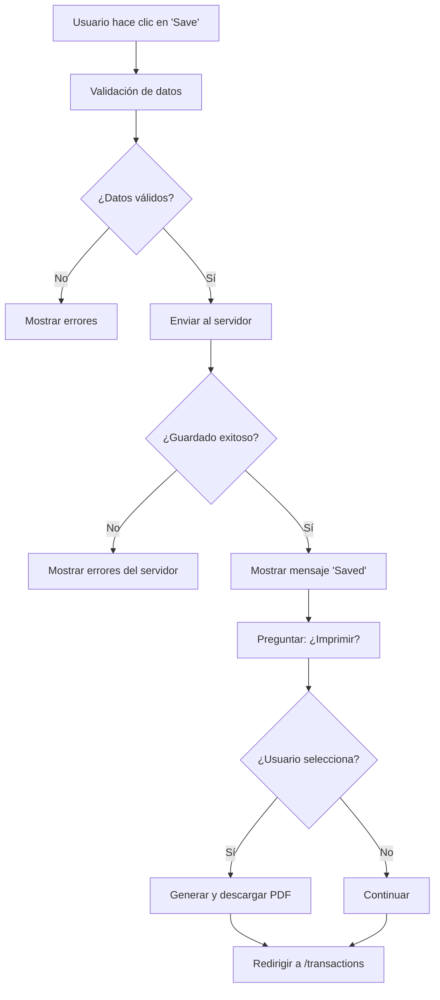

# Funcionalidad de Impresión después de Guardar Transacción

## Descripción

Se ha implementado una funcionalidad que permite al usuario decidir si desea imprimir (generar PDF) de la transacción inmediatamente después de guardarla exitosamente. Esta funcionalidad mejora la experiencia del usuario al ofrecer un flujo integrado de guardado e impresión.

## Características Implementadas

### 🎯 **Flujo de Usuario Mejorado**
1. **Usuario guarda transacción** → Mensaje de éxito
2. **Sistema pregunta** → "¿Desea imprimir el documento?"
3. **Usuario decide** → Sí (descarga PDF) o No (continúa)
4. **Redirección** → Vuelve a la lista de transacciones

### 💡 **Funcionalidades Técnicas**

#### 1. Función de Descarga PDF
**Ubicación**: `vuefrontend/src/components/transactions/TransactionForm.vue`

```javascript
async function downloadTransactionPDF(documentId) {
  try {
    const response = await axios.get(`/api/documents/${documentId}/pdf/`, {
      headers: {
        'Authorization': `Token ${localStorage.getItem('authToken')}`
      }
    })

    // Decodificar base64 y crear blob
    const byteCharacters = atob(response.data.file)
    const byteNumbers = new Array(byteCharacters.length)
    for (let i = 0; i < byteCharacters.length; i++) {
      byteNumbers[i] = byteCharacters.charCodeAt(i)
    }
    const byteArray = new Uint8Array(byteNumbers)
    const blob = new Blob([byteArray], { type: 'application/pdf' })
    
    // Crear enlace de descarga automática
    const url = window.URL.createObjectURL(blob)
    const link = document.createElement('a')
    link.href = url
    link.download = response.data.filename || `transaction_${documentId}.pdf`
    document.body.appendChild(link)
    link.click()
    document.body.removeChild(link)
    window.URL.revokeObjectURL(url)
    
    return true
  } catch (error) {
    // Manejo de errores con SweetAlert
    await Swal.fire({
      icon: 'error',
      title: 'Error',
      text: 'No se pudo generar el PDF del documento. Por favor, intente nuevamente.',
      confirmButtonText: 'Aceptar'
    })
    return false
  }
}
```

#### 2. Integración en el Flujo de Guardado
**Modificación en `handleSubmit()`**:

```javascript
// Después del guardado exitoso
await Swal.fire({ icon: 'success', title: 'Saved', timer: 1200, showConfirmButton: false })

// Preguntar si desea imprimir
const { value: shouldPrint } = await Swal.fire({
  title: '¿Desea imprimir el documento?',
  text: '¿Quiere generar y descargar el PDF de esta transacción?',
  icon: 'question',
  showCancelButton: true,
  confirmButtonColor: '#3085d6',
  cancelButtonColor: '#d33',
  confirmButtonText: 'Sí, imprimir',
  cancelButtonText: 'No, continuar',
  reverseButtons: true
})

if (shouldPrint) {
  const documentId = data.id || idParam
  await downloadTransactionPDF(documentId)
}

// Continuar con redirección normal
router.push('/transactions').catch(() => {})
```

## Experiencia de Usuario

### 🎨 **Interfaz de Usuario**

1. **Mensaje de Éxito** (1.2 segundos)
   - Icono: ✅
   - Título: "Saved"
   - Se cierra automáticamente

2. **Pregunta de Impresión**
   - Icono: ❓
   - Título: "¿Desea imprimir el documento?"
   - Texto: "¿Quiere generar y descargar el PDF de esta transacción?"
   - Botones: "Sí, imprimir" (azul) | "No, continuar" (rojo)

3. **Descarga Automática** (si selecciona "Sí")
   - Descarga inmediata del PDF
   - Nombre del archivo: `{TIPO_DOCUMENTO}_{ID}.pdf`

### 🔄 **Flujo Completo**



## Ventajas de la Implementación

### ✅ **Para el Usuario**
- **Flujo integrado**: No necesita buscar la opción de impresión
- **Decisión consciente**: Puede elegir si necesita el PDF o no
- **Descarga automática**: No requiere pasos adicionales
- **Experiencia fluida**: Todo en una secuencia natural

### ✅ **Para el Sistema**
- **Eficiencia**: Solo genera PDF cuando se necesita
- **Recursos optimizados**: No genera PDFs innecesarios
- **Manejo de errores**: Feedback claro si algo falla
- **Compatibilidad**: Funciona con cualquier tipo de documento

## Casos de Uso

### 📋 **Escenarios Comunes**

1. **Transacción de Venta**
   - Usuario guarda → Quiere factura → Selecciona "Sí" → Obtiene PDF

2. **Transacción de Compra**
   - Usuario guarda → No necesita comprobante → Selecciona "No" → Continúa

3. **Transacción Operacional**
   - Usuario guarda → Necesita registro → Selecciona "Sí" → Obtiene PDF

4. **Edición de Transacción**
   - Usuario edita → Guarda cambios → Puede reimprimir si necesita

## Manejo de Errores

### 🚨 **Errores Posibles**

1. **Error de Autenticación**
   - Token expirado o inválido
   - Solución: Redirigir al login

2. **Error de Generación PDF**
   - Servidor no responde
   - Datos corruptos
   - Solución: Mostrar mensaje de error con SweetAlert

3. **Error de Descarga**
   - Navegador bloquea descarga
   - Sin permisos de escritura
   - Solución: Mensaje informativo al usuario

### 🛡️ **Protecciones Implementadas**

```javascript
// Verificación de respuesta del servidor
if (!response.data || !response.data.file) {
  throw new Error('No se recibió el archivo PDF')
}

// Manejo de errores con feedback visual
catch (error) {
  console.error('Error al descargar PDF:', error)
  await Swal.fire({
    icon: 'error',
    title: 'Error',
    text: 'No se pudo generar el PDF del documento. Por favor, intente nuevamente.',
    confirmButtonText: 'Aceptar'
  })
  return false
}
```

## Configuración y Personalización

### 🎨 **Personalizar Mensajes**

Para cambiar los textos del SweetAlert:

```javascript
const { value: shouldPrint } = await Swal.fire({
  title: 'Tu título personalizado',
  text: 'Tu mensaje personalizado',
  confirmButtonText: 'Tu texto de confirmación',
  cancelButtonText: 'Tu texto de cancelación'
})
```

### 🔧 **Personalizar Comportamiento**

Para cambiar el comportamiento (ej: no preguntar en modo edición):

```javascript
// Solo preguntar en nuevas transacciones
if (!isEditMode) {
  const { value: shouldPrint } = await Swal.fire({...})
  // ... resto del código
}
```

## Pruebas

### 🧪 **Casos de Prueba**

1. **Guardar nueva transacción** → Seleccionar "Sí" → Verificar descarga
2. **Guardar nueva transacción** → Seleccionar "No" → Verificar redirección
3. **Editar transacción** → Guardar → Verificar que funciona igual
4. **Simular error de servidor** → Verificar manejo de errores

### 📊 **Datos de Prueba**

```bash
# Verificar datos disponibles
python manage.py shell -c "from apptransactions.models import Document; print('Documentos:', Document.objects.count())"
```

## Dependencias

### Frontend
- `sweetalert2`: Para diálogos de confirmación
- `axios`: Para peticiones HTTP
- `vue-router`: Para navegación

### Backend
- Sistema de reportes PDF existente
- Endpoint `/api/documents/{id}/pdf/`
- Autenticación por token

## Mantenimiento

### 📝 **Logs y Debugging**

```javascript
// Logs de debugging en la consola del navegador
console.error('Error al descargar PDF:', error)
```

### 🔄 **Actualizaciones Futuras**

- Agregar opción de configuración para habilitar/deshabilitar
- Personalizar textos por tipo de documento
- Agregar estadísticas de uso
- Implementar cache de PDFs generados

## Conclusión

Esta funcionalidad mejora significativamente la experiencia del usuario al proporcionar un flujo integrado y natural para guardar e imprimir transacciones. La implementación es robusta, maneja errores apropiadamente y se integra perfectamente con el sistema existente.
